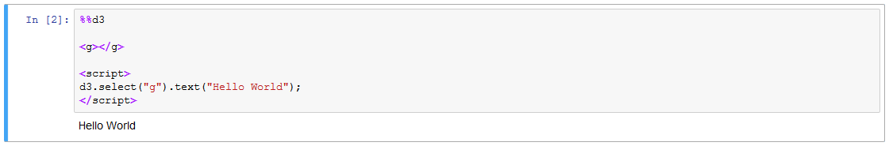
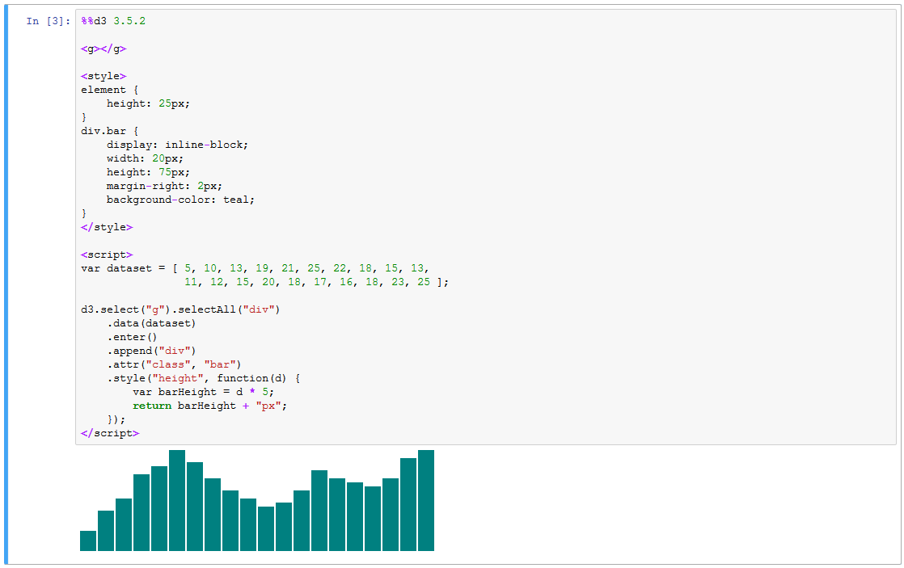
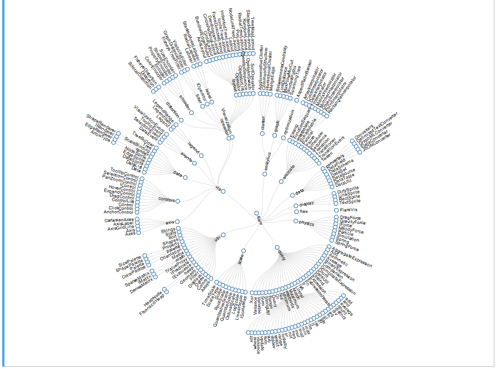
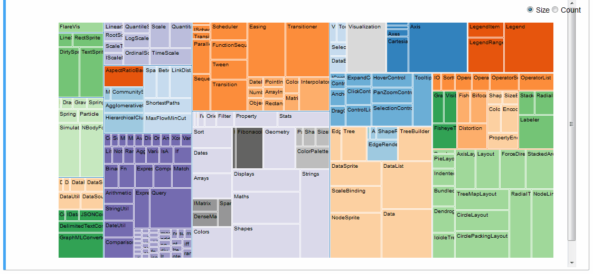
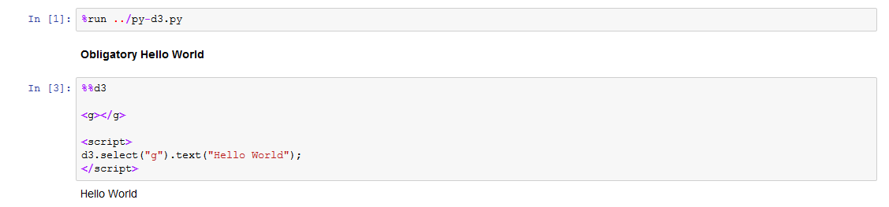

## py_d3  

`py_d3` is an IPython extension which adds D3 support to the Jupyter Notebook environment.

D3 is a well-known and -loved JavaScript data visualization and document object manipulation library which makes it possible to express even extremely complex visual ideas simply using an intuitive grammar. Jupyter is a browser-hosted Python executable environment which provides an intuitive data science interface.

These libraries are foundational cornerstones of web-based data visualization and web-based data science, respectively.  Wouldn't it be great if we could them to work together? This module does just that.

## Quickstart

To create a D3 block in your notebook, add the `%%d3` cell magic to the top of the cell:

To choose a specific version of D3, append the version number onto the end of the line:

Both `3.x` and `4.x` versions of D3 are supported.

`py_d3` allows you to express even very complex visual ideas within a Jupyter Notebook without much difficulty.
A [Radial Reingold-Tilford Tree](http://bl.ocks.org/mbostock/4063550), for example:

An interactive treemap ([original](http://bl.ocks.org/mbostock/4063582)):

Or even the entire [D3 Show Reel](https://bl.ocks.org/mbostock/1256572) animation:

For more examples refer to the [examples notebooks](https://github.com/ResidentMario/py_d3/tree/master/notebooks).

## Installation

The easiest way to get `py_d3` is to `pip install py_d3` and then run `%load_ext py_d3` in Jupyter Notebook.

## Porting

Most HTML-hosted D3 visualizations, even very complex ones, can be made to run inside of a Jupyter Notebook `%%d3` cell with just two modifications:

* Remove any D3 imports in the cell (e.g. ``). D3 is initialized at cell runtime by the `%%d3` cell magic (`3.5.11` by default, you can specify a specific version via line parameter, e.g. `%%d3 3.4.3`).
* Since an HTML document can only have one `<body>` tag, and it's already defined in the Jupyter framing, variants of `d3.select("body").append("g")` won't work. Workaround: define an `<g>` element yourself and then do `d3.select("g")` instead.

These changes alone were sufficient to import the visualizations presented here and in the examples.

## Technicals

Jupyter notebooks allow executing arbitrary JavaScript code using `IPython.display.JavaScript`, however it makes no effort to restrict the level of DOM objects accessible to executable code. Thus if you ran, for instance, `%javascript d3.selectAll("div").remove();`, you would target and remove *all* `div` elements on the page, including the ones making up the notebook itself!

This plugin attempts to improve on a few existing Jupyter-D3 bindings by restricting `d3` scope to whatever cell you are running the code in. It achieves this by monkey-patching subselection over the core `d3.select` and `d3.selectAll` methods (see [this comment by Mike Bostock](https://github.com/d3/d3/issues/2947) for ideation).

`py_d3`, though thoroughly capable, has its quirks:

* Force graphs don't work at all. This appears to stem from assumptions the module makes about its runtime environment within D3 code, best as I can tell. You probably want [`ipython-d3networkx`](https://github.com/jdfreder/ipython-d3networkx) instead.
* The visualizations won't load on page load because you won't have the proper D3 CDN localized until you actually run the cell.
* D3 cells generated via `Run All` will almost always fail and raise a `Maximum Recursion Error`. I think this is because `%%d3` display cells (implemented via `IPython.display.display`) just initialize the JavaScript code and move on, and don't wait for any necessary D3 libraries to download via CDN. By the time D3 is ready, your notebook might be done running! Running the cells individually, one-by-one, works every time. Usually.
* For similar reasons, you may sometimes have to run the first `%%d3` cell on the page twice before cells start working properly.

## Contributing

The codebase is actually [very simple](https://github.com/ResidentMario/py_d3/blob/master/py_d3/py_d3.py). Pull requests
welcome!

## Liscense

MIT.